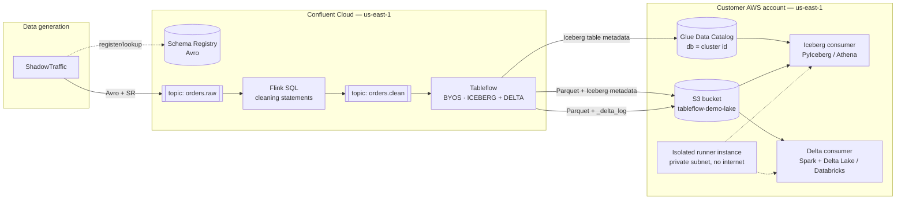
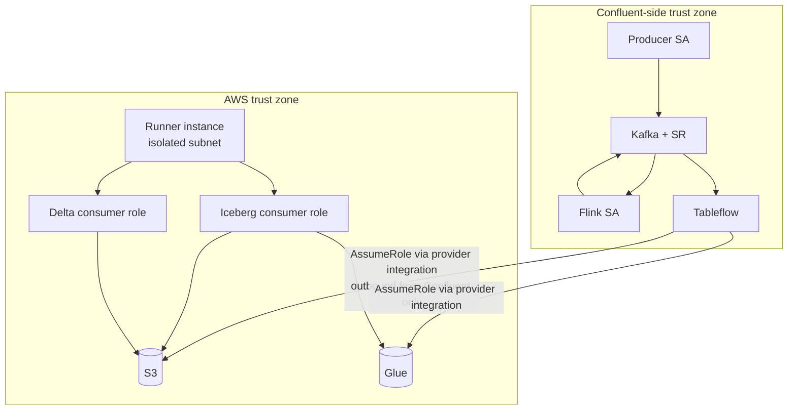

# 01 — Architecture

## Goal

One Kafka topic, cleaned by Flink, materialized by Tableflow into Iceberg **and** Delta in a customer-owned S3 bucket. Two consumers read it — one Iceberg-native, one Delta-native — using only AWS credentials.

## Data flow

## Trust boundaries

The only link between zones is Confluent assuming an IAM role in the AWS account. Nothing in the AWS zone initiates a connection to Confluent.

## Components

| Component | Role | Owner |
|---|---|---|
| ShadowTraffic | Generates `orders.raw` events as Avro with deliberate dirty rows | `shadowtraffic/` |
| Schema Registry | Source of truth for table schemas. Avro subjects pre-registered by Terraform | `schemas/`, `terraform/confluent` |
| Flink SQL | Filters, normalizes, deduplicates into `orders.clean` (append-only) | `flink/` |
| Tableflow | Materializes `orders.clean` to Iceberg + Delta in S3; syncs Iceberg metadata to Glue | `tableflow/`, `terraform/confluent` |
| S3 bucket | Empty at enablement, same region as cluster, Tableflow-managed prefixes never touched by humans | `terraform/aws` |
| Glue Data Catalog | Iceberg pointer store for consumers. Database name = Kafka cluster ID, table name = topic name | `terraform/aws` |
| Consumers | Read-only. AWS creds only | `consumers/` |

## Why this shape

- **Delta forces BYOS.** Tableflow Delta tables support only Bring Your Own Storage. That decision cascades into everything else.
- **Iceberg needs a catalog; Delta doesn't.** Iceberg's current-metadata pointer lives in a catalog. Delta's `_delta_log` is self-describing. See ADR-0002.
- **Consumers can't reach Confluent.** Rules out the built-in Iceberg REST catalog on the read side. Glue is the only catalog Tableflow can push to that lives inside the AWS account. See ADR-0003.
- **Flink before Tableflow.** Cleaning happens once, upstream, instead of in every consumer. Tableflow only accepts append or upsert changelogs, which shapes the SQL (see 04).

## Naming

| Thing | Value |
|---|---|
| Region | `us-east-1` (cluster and bucket must match) |
| Confluent env | `cjackson-tableflow-demo` (`env-876zz7`). Every Confluent display name carries the `cjackson-` prefix because the org is shared. |
| Kafka cluster | `cjackson-tableflow-demo` (`lkc-q2zqngd`), **Standard**, single zone. Basic was tried first and rejected topic-scoped RBAC roles. Tableflow is supported on every cluster type in us-east-1. |
| Service accounts | `cjackson-sa-shadowtraffic`, `cjackson-sa-flink`, `cjackson-sa-terraform-ci` (docs refer to them without the prefix) |
| Flink compute pool | `cjackson-tableflow-demo`, 5 CFU (`lfcp-o3z7jop`) |
| Provider integrations | `cjackson-tableflow-s3` → `tableflow-writer`, `cjackson-tableflow-glue` → `tableflow-glue-writer` (one per role; `customer_role_arn` must be unique per environment) |
| Topics | `orders.raw`, `orders.clean`, `orders.rejected`, `orders_tableflow_errors` (the Tableflow DLQ uses underscores: the Tableflow API rejects periods in `error_handling.log_target`) |
| "BYOS" vs `byob_aws` | Docs say BYOS (Bring Your Own Storage) for the concept; the Terraform provider's block is `byob_aws` and the CLI flag is `--storage-type BYOS`. Same thing. |
| Prefix scope | The `cjackson-` prefix applies to environment-level Confluent resources (environment, cluster, service accounts, pool, provider/catalog integrations). Topics and subjects are cluster-scoped and unprefixed. |
| SR subjects | `orders.raw-key`, `orders.raw-value`, `orders.clean-key`, `orders.clean-value` |
| S3 bucket | `tableflow-demo-lake-<account-id>` |
| Glue database | created by Tableflow, named after the cluster ID. Do not pre-create with a different name. |
