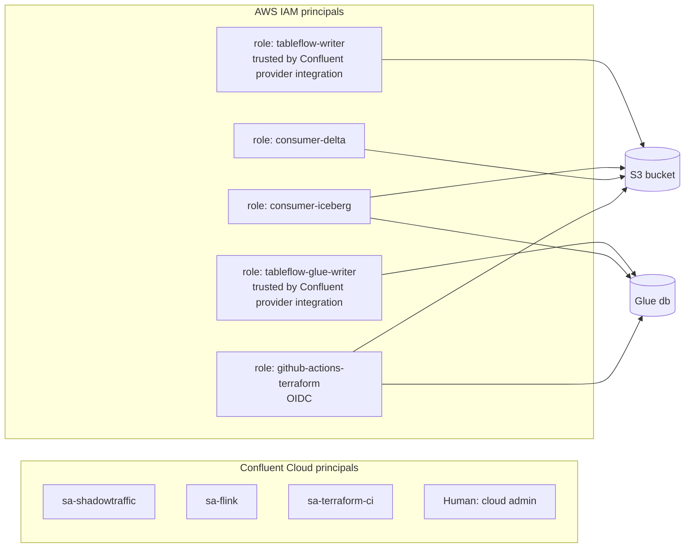

# 02 — Security requirements

## Threat model (what security asked for)

1. Consumers of data in S3 must have **no communication with the Confluent environment**: no Confluent API keys, no Kafka bootstrap, no Tableflow REST catalog endpoint, no Schema Registry URL on the consumer side.
2. Confluent's write access into the AWS account is scoped to one bucket and one Glue database, via AssumeRole, with no long-lived AWS keys.
3. Every human and machine principal is least-privilege and named. No shared "admin" keys in CI.
4. Data files written by Tableflow are never modified or deleted by anything other than Tableflow.

## Principal inventory

`tableflow-writer` and `tableflow-glue-writer` may be one role. They are split here so the Glue permission can be revoked without touching storage.

## Confluent Cloud RBAC

Roles below use Confluent's predefined roles. Grant at the narrowest scope that works; prefer topic/subject prefixes over cluster-wide.

| Principal | Role | Scope | Why |
|---|---|---|---|
| `sa-shadowtraffic` | DeveloperWrite | topic `orders.raw` | produce |
| `sa-shadowtraffic` | DeveloperRead | SR subjects `orders.raw-*` | serializer looks up pre-registered schema IDs |
| `sa-shadowtraffic` | DeveloperWrite | SR subjects `orders.raw-*` | ShadowTraffic registers its (identical) schema at startup and aborts if refused; see docs/03 |
| `sa-flink` | FlinkDeveloper | environment | run statements |
| `sa-flink` | DeveloperRead | topic `orders.raw` | source |
| `sa-flink` | DeveloperWrite | topics `orders.clean`, `orders.rejected` | sinks |
| `sa-flink` | DeveloperManage | topics `orders.clean`, `orders.rejected` | Flink `CREATE TABLE` creates the sink topics |
| `sa-flink` | DeveloperRead + DeveloperWrite | transactional-id `_confluent-flink_*` | Flink writes with Kafka transactions ([Flink RBAC](https://docs.confluent.io/cloud/current/flink/operate-and-deploy/flink-rbac.html)) |
| `sa-flink` | DeveloperRead | SR subjects `orders.raw-*` | read source schema |
| `sa-flink` | DeveloperWrite | SR subjects `orders.clean-*`, `orders.rejected-*` | Flink registers sink schemas |
| `sa-terraform-ci` | EnvironmentAdmin | environment `tableflow-demo` | create topics, SR subjects, RBAC bindings, Flink compute pool, Tableflow enablement, catalog integration |
| `sa-terraform-ci` | Assigner | provider integrations | required to attach provider integrations to Tableflow / catalog integration |
| Human cloud admin | OrganizationAdmin | org | break-glass only; create `sa-terraform-ci` and the provider integration once |

Notes:
- **Cluster type.** Topic- and subject-scoped roles (`DeveloperRead`/`DeveloperWrite` on a topic) are rejected on Basic clusters (`403 Basic Clusters can not use resource roles`). The demo runs a Standard cluster for that reason alone.
- `sa-terraform-ci` also holds `Assigner` on `sa-flink` so CI can submit Flink statements that run as `sa-flink` (Phase 4).
- Tableflow enablement and catalog integration are cluster-level operations. Confluent docs list CloudClusterAdmin + Assigner on provider integrations as prerequisites for catalog integrations; EnvironmentAdmin covers CloudClusterAdmin. If you want CI narrower, replace EnvironmentAdmin with CloudClusterAdmin on the cluster plus explicit SR and Flink grants, and test.
- Schema Registry: set global compatibility to `BACKWARD` (default) or `FULL`. Terraform owns the subjects; the producer never registers schemas (`auto.register.schemas=false`, `use.latest.version=true`). This is the governance story.
- API keys for `sa-shadowtraffic` and `sa-flink` are created by Terraform and written only to GitHub Environment secrets. Rotate by re-running the key resource.
- The `sa-terraform-ci` **Cloud** API key is created by hand (`confluent api-key create --resource cloud --service-account <id>`), not by Terraform: a service account cannot read Cloud API keys through the API, so a Terraform-managed one is seen as missing on every CI run and recreation is refused (403).

## AWS IAM

### Provider integration trust (Confluent → AWS)

Each provider integration hands back its own Confluent-side IAM principal ARN and external ID. There are two (S3 and Glue) because `customer_role_arn` must be unique per environment. The trust policy on `tableflow-writer` allows the S3 integration's principal with its `sts:ExternalId`; `tableflow-glue-writer` allows the Glue integration's pair. Both also allow `sts:TagSession`, per the Confluent provider-integration guide. Values flow from the Confluent root's outputs into the AWS root as `TF_VAR_*` variables on the `prod` environment.

### `tableflow-writer` permissions

Scope: single bucket. Minimum verbs Tableflow documents for BYOS S3 (verify against the current BYOS quick start; the list has changed between releases):

- `s3:ListBucket`, `s3:GetBucketLocation`, `s3:ListBucketMultipartUploads` on the bucket
- `s3:GetObject`, `s3:PutObject`, `s3:PutObjectTagging`, `s3:DeleteObject`, `s3:AbortMultipartUpload`, `s3:ListMultipartUploadParts` on `bucket/*`
- If SSE-KMS: `kms:GenerateDataKey*`, `kms:Decrypt`, `kms:Encrypt`, `kms:ReEncrypt*`, `kms:DescribeKey` on the bucket key (see Confluent "self-managed encryption keys with Tableflow")

Verified in Phase 1 against the Configure Storage page (docs/09 Q8). Implemented in `terraform/aws/iam-writer.tf`. The demo uses SSE-S3, so no KMS statement is attached.

### `tableflow-glue-writer` permissions

Scope: the Glue database Tableflow creates (name = cluster ID). Verbs: `glue:CreateDatabase`, `glue:GetDatabase`, `glue:GetDatabases`, `glue:CreateTable`, `glue:GetTable`, `glue:GetTables`, `glue:UpdateTable`, `glue:DeleteTable`. Confluent does not publish this list; the Console generates a template per integration. This is a superset to be diffed against that template in Phase 5 (docs/09 Q8). Resource ARNs limited to `catalog`, `database/<cluster-id>`, `table/<cluster-id>/*`.

### `consumer-iceberg` permissions

- `glue:GetDatabase`, `glue:GetTable`, `glue:GetTables`, `glue:GetPartitions` on the Tableflow database only
- `s3:ListBucket` on the bucket, `s3:GetObject` on `bucket/*`
- No write verbs. No `glue:UpdateTable`.
- If using Athena: `athena:*Query*` on a dedicated workgroup plus its results bucket.

### `consumer-delta` permissions

- `s3:ListBucket` on the bucket, `s3:GetObject` on `bucket/*`
- Nothing else. This role is the proof that Delta needs no catalog.

### `github-actions-terraform`

OIDC trust to the `gogetjax/tableflow-demo` repo on `environment:prod` (the `sub` claim carries one value; environment-gated jobs use the environment form, and only `main` runs the apply workflows). The repo has GitHub's immutable subject claim enabled, so the `sub` is `repo:gogetjax@<owner-id>/tableflow-demo@<repo-id>:environment:prod`; the trust accepts both that and the plain form. The account's GitHub OIDC provider predates this repo, so Terraform references it with a data source. Permissions: manage the lake bucket, the six roles and their `tableflow-demo-*` policies, the consumer VPC (`ec2:*`, since EC2 resource-level scoping across a VPC lifecycle is impractical in a demo account), Glue read for verification, plus read/write on the Terraform state bucket and lock table. Explicit `Deny` on `sts:AssumeRole` into the consumer roles. Implemented in `terraform/aws/iam-github.tf`.

A second role, `github-actions-consumers`, trusts `environment:consumers` and can only assume the two consumer roles.

## Bucket policy

Explicit denies, in this order of importance:

1. Deny `s3:PutObject`, `s3:DeleteObject*`, `s3:AbortMultipartUpload` to any principal except `tableflow-writer` and (for lifecycle/teardown only) `github-actions-terraform`.
2. Deny all access unless `aws:SecureTransport` is true.
3. Deny `s3:PutObject` whose encryption header names anything other than SSE-S3 or SSE-KMS. Requests with no header fall through to bucket default encryption (SSE-S3), so this never blocks Tableflow, whose header behavior is not documented. A strict "header required" deny was considered and rejected for that reason.
4. Allow `s3:GetObject` and `s3:ListBucket` to `consumer-iceberg`, `consumer-delta`.

Bucket settings: versioning on (protects against accidental deletes), Block Public Access all four, Object Ownership = bucket owner enforced, lifecycle rule **none** on Tableflow prefixes (Tableflow manages retention; a lifecycle rule would corrupt tables).

## Network

- Consumers run in a VPC with S3 and Glue **gateway/interface endpoints** and no route to the public internet during the demo. This makes "no Confluent communication" verifiable, not just policy.
- The bucket policy may additionally require `aws:SourceVpce` for consumer roles. Do not add this condition to the `tableflow-writer` statements; Confluent connects from its own network.
- Confluent cluster networking: public is fine for the demo. Private networking removes Managed Storage as an option, which we don't use anyway.

## Verification (must pass before the README claims isolation)

| Check | How |
|---|---|
| Consumer roles have zero Confluent references | `grep -ri confluent consumers/` returns only comments; IAM policies contain no `secretsmanager` reads of Confluent keys |
| Consumer VPC has no egress | Run the consumer from a subnet with no NAT/IGW; the read must still succeed |
| Writer cannot read consumer data via other paths | Not applicable; writer needs `GetObject` for compaction. Document it. |
| CloudTrail shows only expected principals on the bucket | Query CloudTrail data events for the bucket over the demo window |
| No human wrote to the bucket | Same CloudTrail query, filter `PutObject` by principal |
