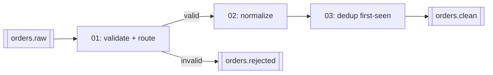

# 04 — Flink spec (shift-left cleaning)

## Hard rule

Tableflow does not support retract changelog mode. Every statement whose sink feeds Tableflow must produce an **append-only** or **upsert** stream. Practically:

- Filters, projections, casts, `CASE`, `UPPER()` — append-only. Safe.
- Deduplication keeping the **first** row per key (`ROW_NUMBER() ... ORDER BY $rowtime ASC ... WHERE rn = 1`) — append-only. Safe.
- Deduplication keeping the **last** row — emits updates. Only safe if the sink table has a primary key and `changelog.mode = 'upsert'`.
- Non-windowed `GROUP BY` aggregations — retract. Not allowed upstream of Tableflow.
- Regular joins — retract. Not allowed. Use temporal or interval joins if you add enrichment later.

Verify each sink with `SHOW CREATE TABLE` and confirm `changelog.mode` before enabling Tableflow on it.

## Pipeline



Statements live in `flink/` and are applied in file order. Each file is one statement.

## Tables

Confluent Cloud Flink auto-creates a table for every topic with a Schema Registry schema. `orders.raw` will already exist as a table. For sinks, create them explicitly so key schema, changelog mode, and distribution are deliberate:

- `orders.clean` — `PRIMARY KEY (order_id) NOT ENFORCED`, `DISTRIBUTED BY HASH(order_id)`, `'changelog.mode' = 'append'`, `'value.format' = 'avro-registry'`, `'key.format' = 'avro-registry'`. The primary key gives the topic a key schema, which Tableflow requires.
- `orders.rejected` — same shape plus a `reject_reason STRING` column. Not Tableflow-enabled in Phase 1; it exists so bad rows are observable.

Exact `CREATE TABLE` option names come from the Confluent Cloud Flink SQL reference (`WITH` options for `changelog.mode`, formats, `kafka.retention.time`). Do not copy open-source Flink connector options; Confluent Cloud's table options differ.

## Statements (sketch)

`flink/01-route-invalid.sql`

```sql
-- Pseudocode-level. Finalize against Confluent Cloud Flink SQL reference in Phase 4.
INSERT INTO orders.rejected
SELECT *, CASE
    WHEN customer_id IS NULL THEN 'null_customer'
    WHEN quantity <= 0 THEN 'non_positive_quantity'
    WHEN ordered_at > CURRENT_TIMESTAMP + INTERVAL '1' DAY THEN 'future_timestamp'
  END AS reject_reason
FROM orders.raw
WHERE customer_id IS NULL OR quantity <= 0 OR ordered_at > CURRENT_TIMESTAMP + INTERVAL '1' DAY;
```

`flink/02-normalize-and-dedup.sql`

```sql
INSERT INTO orders.clean
SELECT order_id, customer_id, product_id, quantity, unit_price_cents,
       UPPER(currency) AS currency, ordered_at, status, source
FROM (
  SELECT *, ROW_NUMBER() OVER (PARTITION BY order_id ORDER BY $rowtime ASC) AS rn
  FROM orders.raw
  WHERE customer_id IS NOT NULL AND quantity > 0
    AND ordered_at <= CURRENT_TIMESTAMP + INTERVAL '1' DAY
) WHERE rn = 1;
```

Two statements read `orders.raw` twice. Acceptable at demo volume; simpler than a shared intermediate topic.

## Compute pool

One compute pool, 5 CFU cap, in the same region. Statements run under `sa-flink` (see 02). Terraform owns the pool; statements are applied by a script in Phase 4 using the `confluent flink statement create` CLI or the Terraform `confluent_flink_statement` resource — pick one and document why in the PR.

## Acceptance

- `orders.clean` has no duplicate `order_id` in a 10-minute sample.
- `orders.clean` has no null `customer_id`, no `quantity <= 0`, all `currency` uppercase.
- `orders.rejected` receives rows at roughly the injected dirty rate.
- `SHOW CREATE TABLE orders.clean` reports append changelog mode and avro-registry key + value formats.
