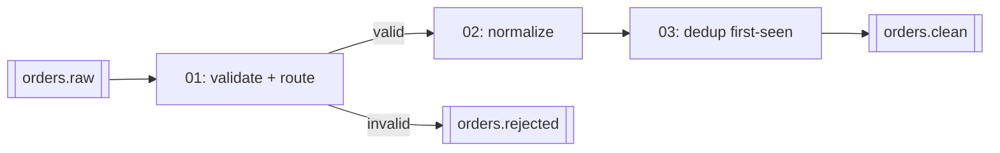

# 04 — Flink spec (shift-left cleaning)

## Hard rule

Tableflow does not support retract changelog mode. Every statement whose sink feeds Tableflow must produce an **append-only** or **upsert** stream. Practically:

- Filters, projections, casts, `CASE`, `UPPER()` — append-only. Safe.
- Deduplication keeping the **first** row per key (`ROW_NUMBER() ... ORDER BY $rowtime ASC ... WHERE rn = 1`) — append-only. Safe.
- Deduplication keeping the **last** row — emits updates. Only safe if the sink table has a primary key and `changelog.mode = 'upsert'`.
- Non-windowed `GROUP BY` aggregations — retract. Not allowed upstream of Tableflow.
- Regular joins — retract. Not allowed. Use temporal or interval joins if you add enrichment later.

Verify each sink with `SHOW CREATE TABLE` and confirm `changelog.mode` before enabling Tableflow on it.

## Pipeline



Statements live in `flink/` and are applied in file order by `flink/apply.sh`. Each file is one statement, named `tableflow-demo-<file>`. The script uses `confluent flink statement create ... --service-account sa-flink --wait` (chosen over `confluent_flink_statement` in Terraform so a failing statement is a visible CLI result, not a Terraform state problem, and so DDL and DML can be re-run independently). It skips names that already exist and re-creates ones in `FAILED` state.

## Tables

Confluent Cloud Flink auto-creates a table for every topic, with or without a schema. `orders.raw` already exists as a table. For sinks, create them explicitly so key schema, changelog mode, and distribution are deliberate. **The sink topics must not pre-exist**: `CREATE TABLE` fails with `already exists in Catalog` if Terraform created the topic first (observed in Phase 4, so `orders.clean` and `orders.rejected` were removed from `terraform/confluent/topics.tf`). Flink creates the topic and both Schema Registry subjects, which needs `DeveloperManage` on the topic name plus read/write on `_confluent-flink_*` transactional IDs for the INSERTs (docs/02).

- `orders.clean` — `PRIMARY KEY (order_id) NOT ENFORCED`, `DISTRIBUTED BY HASH(order_id)`, `'changelog.mode' = 'append'`, `'value.format' = 'avro-registry'`, `'key.format' = 'avro-registry'`, `'value.fields-include' = 'all'`. The primary key gives the topic a key schema, which Tableflow requires; `value.fields-include` keeps `order_id` in the value so it lands in the table (see Acceptance).
- `orders.rejected` — same shape plus a `reject_reason STRING` column. Not Tableflow-enabled in Phase 1; it exists so bad rows are observable.

Exact `CREATE TABLE` option names come from the Confluent Cloud Flink SQL reference (`WITH` options for `changelog.mode`, formats, `kafka.retention.time`). Do not copy open-source Flink connector options; Confluent Cloud's table options differ.

## Statements

Final SQL is in `flink/00-create-orders-rejected.sql`, `01-create-orders-clean.sql`, `02-route-invalid.sql`, `03-normalize-and-dedup.sql`. Two things differ from the sketch below: the Avro enum `status` is read by Flink as a `STRING`-like enum type and is `CAST(... AS STRING)` for the sink, and the nullable `customer_id` union becomes `STRING` in `orders.rejected` but `STRING NOT NULL` in `orders.clean` (the filter guarantees it).

### Sketch (kept for the reasoning)

`flink/01-route-invalid.sql`

```sql
-- Pseudocode-level. Finalize against Confluent Cloud Flink SQL reference in Phase 4.
INSERT INTO orders.rejected
SELECT *, CASE
    WHEN customer_id IS NULL THEN 'null_customer'
    WHEN quantity <= 0 THEN 'non_positive_quantity'
    WHEN ordered_at > CURRENT_TIMESTAMP + INTERVAL '1' DAY THEN 'future_timestamp'
  END AS reject_reason
FROM orders.raw
WHERE customer_id IS NULL OR quantity <= 0 OR ordered_at > CURRENT_TIMESTAMP + INTERVAL '1' DAY;
```

`flink/02-normalize-and-dedup.sql`

```sql
INSERT INTO orders.clean
SELECT order_id, customer_id, product_id, quantity, unit_price_cents,
       UPPER(currency) AS currency, ordered_at, status, source
FROM (
  SELECT *, ROW_NUMBER() OVER (PARTITION BY order_id ORDER BY $rowtime ASC) AS rn
  FROM orders.raw
  WHERE customer_id IS NOT NULL AND quantity > 0
    AND ordered_at <= CURRENT_TIMESTAMP + INTERVAL '1' DAY
) WHERE rn = 1;
```

Two statements read `orders.raw` twice. Acceptable at demo volume; simpler than a shared intermediate topic.

## Compute pool

One compute pool, 5 CFU cap, in the same region. Statements run under `sa-flink` (see 02). Terraform owns the pool; statements are applied by a script in Phase 4 using the `confluent flink statement create` CLI or the Terraform `confluent_flink_statement` resource — pick one and document why in the PR.

## Acceptance

- `orders.clean` has no duplicate `order_id` in a 10-minute sample.
- `orders.clean` has no null `customer_id`, no `quantity <= 0`, all `currency` uppercase.
- `orders.rejected` receives rows at roughly the injected dirty rate.
- `SHOW CREATE TABLE orders.clean` reports append changelog mode and avro-registry key + value formats.

### Observed, 2026-09-22

Bounded Flink queries (`/*+ OPTIONS('scan.bounded.mode'='latest-offset') */`) over the entire sink topics, run as `sa-flink` about 80 minutes into a ShadowTraffic run at ~3.3 events/s. A same-time count of `orders.raw` gave 16395 rows / 15582 distinct `order_id`. CLI consumer samples (365 clean rows, 363 rejected rows) agreed but the CLI consumer dropped mid-stream repeatedly on this WSL host, so the full-topic query is the record.

| Check | Result |
|---|---|
| `orders.clean` rows | 14351 (all distinct `order_id`) |
| duplicate `order_id` | 0 |
| null `customer_id` | 0 |
| `quantity <= 0` | 0 |
| `currency` not uppercase | 0 |
| `orders.rejected` rows | 936 |
| reject reasons | non_positive_quantity 441, null_customer 330, future_timestamp 165 |

`SHOW CREATE TABLE orders.clean` (trimmed to the relevant options):

```sql
CREATE TABLE `cjackson-tableflow-demo`.`lkc-q2zqngd`.`orders.clean` (
  `order_id` VARCHAR(2147483647) NOT NULL,
  ...
  `ordered_at` TIMESTAMP(3) WITH LOCAL TIME ZONE NOT NULL,
  CONSTRAINT `PK_order_id` PRIMARY KEY (`order_id`) NOT ENFORCED
)
DISTRIBUTED BY HASH(`order_id`) INTO 6 BUCKETS
WITH (
  'changelog.mode' = 'append',
  'connector' = 'confluent',
  'kafka.retention.time' = '7 d',
  'key.format' = 'avro-registry',
  'scan.startup.mode' = 'earliest-offset',
  'value.fields-include' = 'all',
  'value.format' = 'avro-registry'
)
```

**`value.fields-include = 'all'` is required.** Confluent Cloud Flink's default is `except-key`, which strips the primary-key column from the Kafka *value*. Tableflow materializes the value schema, so without this option the Iceberg/Delta table would have no `order_id` column. The first build of the tables had this bug; they were dropped (topics and the four subjects deleted by an admin, since `sa-flink` has no subject delete permission) and re-created.

Schema Registry after the DDL: `orders.clean-key`, `orders.clean-value`, `orders.rejected-key`, `orders.rejected-value` exist (registered by `sa-flink`).
