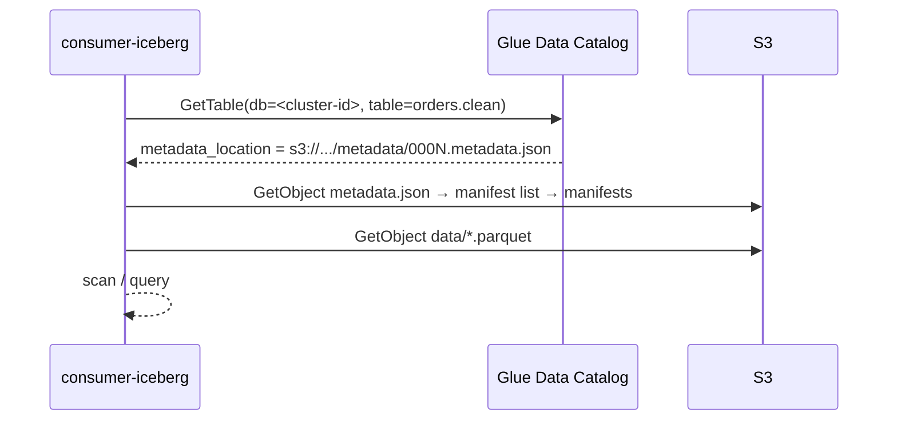
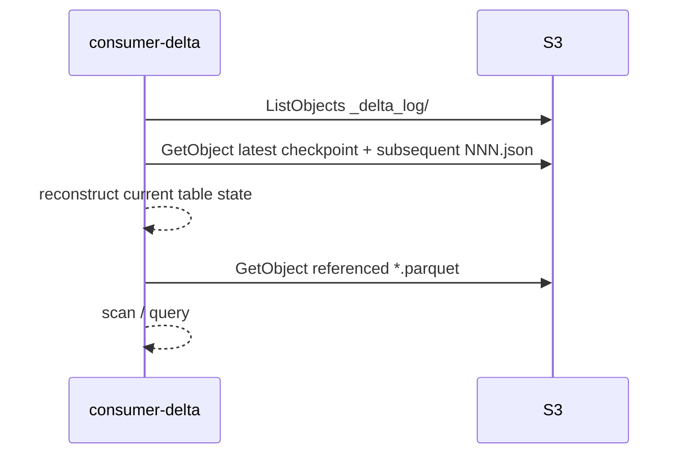

# 06 — Consumer spec

Two consumers, one bucket. Both prove the same point from opposite directions: Iceberg needs a catalog, Delta doesn't, and neither needs Confluent.

## Isolation contract (applies to both)

- Runs under an IAM role from 02 (`consumer-iceberg` or `consumer-delta`).
- Environment contains AWS region + role. Nothing else. No `CONFLUENT_*`, no `SCHEMA_REGISTRY_*`, no bootstrap servers.
- Runs from the isolated subnet (no NAT/IGW) in the demo. If it works there, isolation is proven.
- Read-only. Any write attempt is a bug and is also blocked by policy.

## Iceberg consumer — via Glue

Implementations, in order of usefulness for the demo:

1. **PyIceberg** (`consumers/iceberg/pyiceberg_read.py`): `load_catalog` with `type=glue`, region, and the role's credentials via the default chain. Load `<cluster-id>.orders.clean`, print schema, current snapshot ID, row count, and 5 rows. Rerun after 5 minutes and show the snapshot ID advanced.
2. **Athena** (`consumers/iceberg/athena.sql`): `SELECT count(*), max(ordered_at) FROM "<cluster-id>"."orders.clean"`. Athena reads Iceberg via Glue natively. Needs a workgroup and results bucket (see 02).
3. **DuckDB** (optional): `iceberg` extension against Glue's Iceberg REST endpoint with SigV4. Only if time permits; it stays inside AWS so it satisfies the constraint.

Do **not** ship the "catalog-less" path (`StaticTable` on a hand-picked `metadata.json`) as a supported consumer. Document it in the README as an anti-pattern with the reasons from ADR-0002.

## Delta consumer — by path

Implementations:

1. **delta-rs** (`consumers/delta/deltalake_read.py`): `DeltaTable("s3://tableflow-demo-lake-<acct>/<path-to-orders.clean>")`. Print `version()`, schema, row count, 5 rows. Rerun to show version advanced.
2. **DuckDB** (`consumers/delta/duckdb_read.sql`): `SELECT count(*) FROM delta_scan('s3://.../orders.clean')` with the `httpfs` + `delta` extensions and the AWS credential chain.
3. **Databricks** (`consumers/delta/databricks.sql`, not run in CI): `CREATE TABLE demo.orders_clean USING DELTA LOCATION 's3://...'` as an external table. This is exactly what Confluent's Unity Catalog integration would do for you; here it's manual, which keeps Databricks out of the trust picture with Confluent.

The Delta table path is an implementation detail of Tableflow's layout (09-Q4). Resolve it once and put it in `consumers/delta/.env.example`; the consumer must not need Confluent to discover it.

## Comparison the demo should print

| | Iceberg consumer | Delta consumer |
|---|---|---|
| Discovery | Glue catalog | S3 path |
| AWS permissions | Glue read + S3 read | S3 read |
| Confluent permissions | none | none |
| Current-version pointer | Glue `metadata_location` | highest `_delta_log/NNN.json` |
| Row count at time T | should match | should match |

Both counts should agree within one Tableflow commit window. Print both side by side.

## CI smoke test

`.github/workflows/consumers-smoke.yml`: assumes each consumer role via OIDC, runs the PyIceberg and delta-rs scripts, asserts row counts > 0 and equal within tolerance. Runs on a schedule and on PRs touching `consumers/`.
