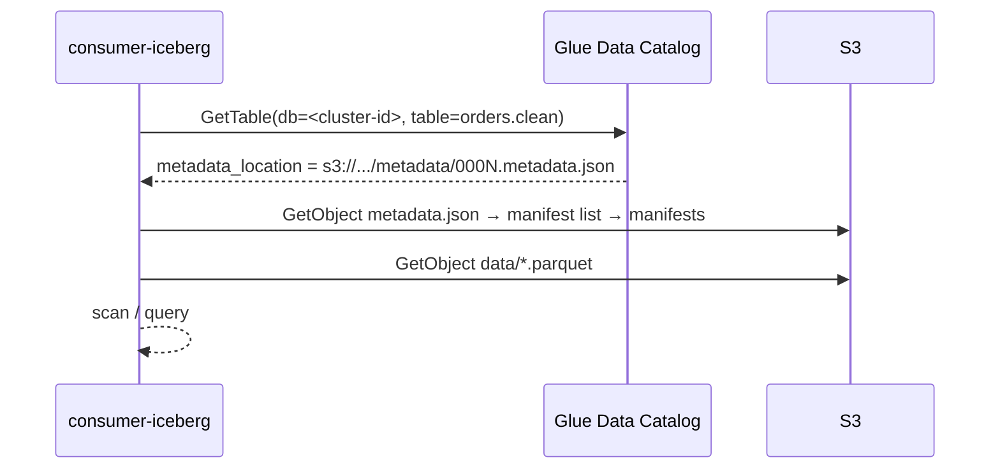
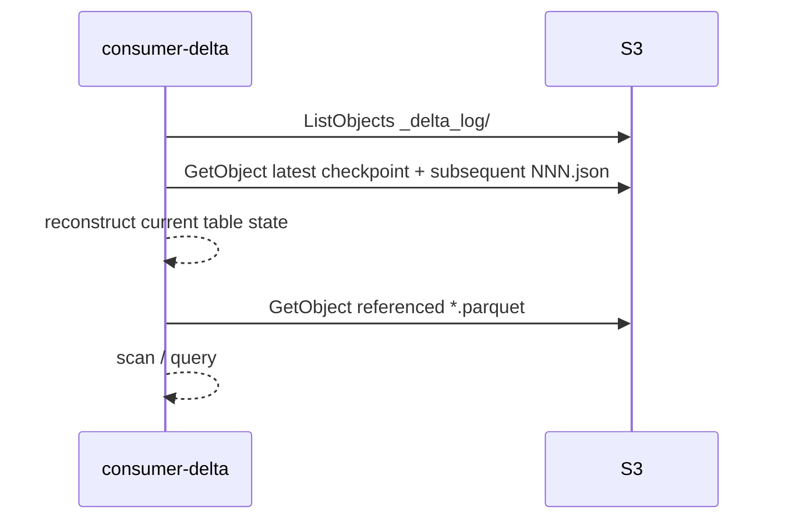

# 06 — Consumer spec

Two consumers, one bucket. Both prove the same point from opposite directions: Iceberg needs a catalog, Delta doesn't, and neither needs Confluent.

## Isolation contract (applies to both)

- Runs under an IAM role from 02 (`consumer-iceberg` or `consumer-delta`).
- Environment contains AWS region + role. Nothing else. No `CONFLUENT_*`, no `SCHEMA_REGISTRY_*`, no bootstrap servers.
- Runs from the isolated subnet (no NAT/IGW) in the demo. If it works there, isolation is proven.
- Read-only. Any write attempt is a bug and is also blocked by policy.

## Iceberg consumer — via Glue

Implementations, in order of usefulness for the demo:

1. **PyIceberg** (`consumers/iceberg/pyiceberg_read.py`): `load_catalog` with `type=glue`, region, and the role's credentials via the default chain. Load `<cluster-id>.orders.clean`, print schema, current snapshot ID, row count, and 5 rows. Rerun after 5 minutes and show the snapshot ID advanced.
2. **Athena** (`consumers/iceberg/athena.sql`): `SELECT count(*), max(ordered_at) FROM "<cluster-id>"."orders.clean"`. Athena reads Iceberg via Glue natively. Needs a workgroup and results bucket (see 02).
3. **DuckDB** (optional): `iceberg` extension against Glue's Iceberg REST endpoint with SigV4. Only if time permits; it stays inside AWS so it satisfies the constraint.

Do **not** ship the "catalog-less" path (`StaticTable` on a hand-picked `metadata.json`) as a supported consumer. Document it in the README as an anti-pattern with the reasons from ADR-0002.

## Delta consumer — by path

Implementations, as built in Phase 6. **Spark + Delta Lake is the reference Delta consumer**; delta-rs and DuckDB are documented probes that record their failure mode.

1. **Spark + Delta Lake** (`consumers/delta/spark_read.py`, the reference reader): PySpark 3.5 local mode with `delta-spark` 3.3, `DeltaTable.forPath` / `spark.read.format("delta").load(path)`. Prints version, schema, row count, 5 rows. On the isolated runner it uses bundled jars (`SPARK_JARS`) and a bundled JDK; nothing is fetched from Maven.
2. **delta-rs** (`consumers/delta/deltalake_read.py`, probe): **does not read Tableflow's table** with `deltalake` 1.6.5 (latest release at time of writing; no newer version advertises `typeWidening` reader support). Tableflow's Delta log upgrades the protocol at commit 1 to reader version 3 with reader features `typeWidening`, `deletionVectors`, `columnMapping`; delta-rs rejects `typeWidening` on both its pyarrow and DataFusion paths. Kept as the probe; `--version-only` works because reading the log does not need the features.
3. **DuckDB** (`consumers/delta/duckdb_read.sql`, probe): `delta_scan` returns the right `count(*)` but **every column is NULL** (DuckDB 1.5.5 with delta extension `45c4087`, and the 2.0.0-dev nightly with `d1b2ffd7de`). The table uses column mapping mode `id` with physical names `col_N` in the Delta schema while the Parquet files carry the logical names plus `PARQUET:field_id`; DuckDB resolves by physical name. Kept as the probe.
4. **Databricks** (`consumers/delta/databricks.sql`, not run in CI): `CREATE TABLE ... USING DELTA LOCATION '<table_path>'`. Databricks Runtime reads column mapping `id`, type widening and deletion vectors natively. This is exactly what Confluent's Unity Catalog integration would register for you; here it's manual, which keeps Databricks out of the trust picture with Confluent.

So "Delta needs no catalog" holds, but "any Delta reader will do" does not: Tableflow's Delta output currently needs a Delta Kernel / Spark-class reader. Recorded as 09-Q11.

The Delta table path is `table_path` from Tableflow (09-Q4), fixed in `consumers/delta/.env.example`; the consumer never needs Confluent to discover it.

## Comparison the demo should print

| | Iceberg consumer | Delta consumer |
|---|---|---|
| Discovery | Glue catalog | S3 path |
| AWS permissions | Glue read + S3 read | S3 read |
| Confluent permissions | none | none |
| Reader | PyIceberg 0.11 | Spark 3.5 + Delta 3.3 |
| Current-version pointer | Glue `metadata_location` | highest `_delta_log/NNN.json` |
| Row count at time T | should match | should match |

Both counts should agree within one Tableflow commit window. Print both side by side.

## CI smoke test

`.github/workflows/consumers-smoke.yml` (Phase 7): assumes each consumer role via OIDC, runs the PyIceberg and Spark scripts, asserts row counts > 0 and equal within tolerance. Runs on a schedule and on PRs touching `consumers/`. `.github/workflows/consumers-check.yml` (Phase 6) fails if any code or config under `consumers/` carries Confluent connection material (hostnames, `CONFLUENT_*`, Schema Registry / bootstrap / SASL settings); prose mentions are allowed.

## Isolated run (Phase 6 evidence)

`terraform/aws/consumers-runtime.tf` adds an SSM-managed Amazon Linux 2023 instance in the private subnet (no IGW, no NAT), interface endpoints for SSM, STS and Athena next to the Glue one, an S3 gateway endpoint, a tooling bucket with the scripts, a Python 3.9 wheelhouse, the Spark/Delta jars and a JDK, and a CloudTrail trail of the lake bucket's data events. `consumers/runner/run.sh` sends `consumers/runner/bootstrap.sh` to the instance through SSM; the script first proves there is no internet route (`curl https://docs.confluent.io` must time out), then runs both readers under their consumer roles and prints the side-by-side table.
