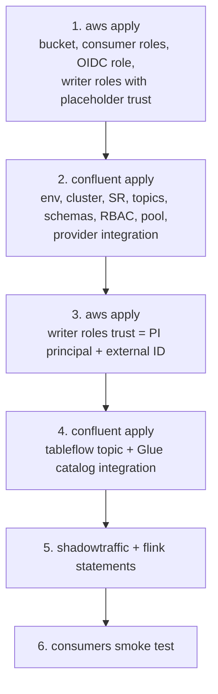

# 07 — Terraform and CI/CD

## Layout

```
terraform/
  bootstrap/               # LOCAL state: creates the state bucket + lock table, applied once by hand
    main.tf
  aws/                     # state: s3 backend, key aws/terraform.tfstate
    versions.tf            # pins, s3 backend
    variables.tf           # region, PI principal/external id, kafka_cluster_id, extra consumer trust
    main.tf                # lake bucket + bucket policy (Glue db is created by Tableflow; see note)
    iam-writer.tf          # tableflow-writer, tableflow-glue-writer (two-pass trust from Confluent PI)
    iam-consumers.tf       # consumer-iceberg, consumer-delta
    iam-github.tf          # github-actions-terraform, github-actions-consumers (OIDC)
    network.tf             # consumer VPC, private subnet, S3 gateway + Glue interface endpoints
    outputs.tf             # role ARNs, bucket name, subnet/SG ids
  confluent/               # state: s3 backend, key confluent/terraform.tfstate
    env.tf                 # environment, SR (Essentials), cluster
    topics.tf              # orders.raw, orders_tableflow_errors (orders.clean/rejected are created by Flink DDL)
    schemas.tf             # SR subjects from ../../schemas/*.avsc, compatibility
    rbac.tf                # service accounts, role bindings, API keys → outputs (sensitive)
    flink.tf               # compute pool
    provider-integration.tf# confluent_provider_integration (AWS)
    tableflow.tf           # confluent_tableflow_topic for orders.clean
    catalog.tf             # confluent_catalog_integration (Glue)
```

Two root modules, two states. AWS first, Confluent second, then one AWS re-apply to finalize trust policies.

Glue note: Tableflow creates the database itself. Terraform does not create it; it only grants permissions on the expected ARN pattern. If you want Terraform to "own" it for teardown, import after first sync.

## Bootstrap order



Step 1 ran locally in Phase 1 because it creates the CI role itself. Step 2 ran locally in Phase 2 because CI had no Confluent key yet. Steps 3–4 are `terraform apply` runs in GitHub Actions on the `prod` environment. Step 5 is scripted. Step 6 is a workflow. Exact commands for the step 3 re-apply are in `terraform/README.md`.

## GitHub Actions

| Workflow | Trigger | Does |
|---|---|---|
| `tf-plan.yml` | PR touching `terraform/**` or `schemas/**` | fmt, validate, plan for both roots, plan posted as PR comment. Runs on the `prod` environment so OIDC can assume the Terraform role |
| `tf-apply-aws.yml` | push to `main`, path `terraform/aws/**` | apply with `environment: prod` approval |
| `tf-apply-confluent.yml` | push to `main`, path `terraform/confluent/**` or `schemas/**` | apply with approval |
| `flink-apply.yml` | manual | applies `flink/*.sql` in order, idempotent (skip if statement name exists) |
| `consumers-smoke.yml` | schedule + PR on `consumers/**` | assumes consumer roles via OIDC, runs reads, asserts |

Auth:
- AWS: OIDC to `github-actions-terraform`. No static keys. Role ARN in the `prod` environment variable `AWS_TERRAFORM_ROLE_ARN`; the two PI principal/external-ID pairs and the cluster ID in `TF_VAR_CONFLUENT_PI_*`, `TF_VAR_CONFLUENT_GLUE_PI_*`, `TF_VAR_KAFKA_CLUSTER_ID` (set in Phase 2).
- Confluent: `CONFLUENT_CLOUD_API_KEY/SECRET` for `sa-terraform-ci` in the `prod` GitHub Environment, plus `TABLEFLOW_API_KEY/SECRET` (a Tableflow-scoped key for the same service account, created by hand like the Cloud key; passed to Terraform as `TF_VAR_tableflow_api_*` for `confluent_tableflow_topic` and `confluent_catalog_integration`). The first Confluent apply ran locally under a temporary Cloud API key for the human admin, which was deleted once CI ran green on the SA key.
- Consumer roles: separate OIDC trust conditions (`environment:consumers`) so the Terraform role can't be used to read data and vice versa.

## Pins

- Terraform ≥ 1.9 (CI runs 1.13.3), `confluentinc/confluent` provider pinned to an exact version; record the registry doc URL for that version in `terraform/confluent/README.md`.
- `hashicorp/aws` pinned to 6.66.0.
- Renovate or Dependabot on provider versions with plan-only PRs.

## Teardown

Order matters: disable Tableflow on the topic (tables delete asynchronously per retention), wait, then Confluent destroy, then AWS destroy. Bucket has `force_destroy = true` only in the demo.
